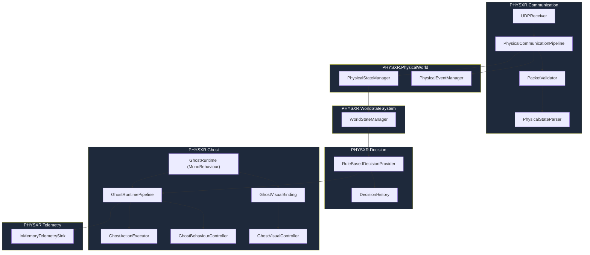

# PHYS-XR

PHYS-XR is an embodied-AI / mixed-reality game project exploring **physical-world-aware AI behaviour**: a virtual "Ghost" agent that reacts to a player's real physical surroundings (presence, proximity, disturbances) alongside in-game/virtual signals, through a deterministic, explainable decision pipeline.

The core idea is a semantic bridge between physical sensing and a Unity-side AI agent:

```
Physical sensors → semantic PhysicalState/PhysicalEvent → WorldState → decision → Ghost behaviour
```

Rather than coupling sensor data directly to gameplay logic, the project defines a chain of small, independently-testable contracts (`PhysicalState`, `WorldState`, `GhostAction`, `GhostExecutionState`) so that the sensing source, the decision strategy, and the Ghost's presentation can each evolve independently.

This README documents **only what currently exists in this repository** — not the intended final product.

---

## Current Project Status

| Area | Status | Notes |
|---|---|---|
| Core data contracts (`PhysicalState`, `WorldState`, `GhostAction`, etc.) | ✅ Complete | Stable, frozen shape; consumed throughout the pipeline |
| Semantic physical state/event model | ✅ Complete | `PhysicalState` / `PhysicalEvent`, populated via simulation or communication layer |
| Communication layer (packet validation/parsing/UDP) | ✅ Complete (software-only) | Full validation/parsing/staleness pipeline implemented and tested; wire format is explicitly provisional; no real ESP32 firmware in this repo |
| `WorldStateManager` | ✅ Complete, with a known gap | Assembles Physical/Player/Virtual/Ghost state into `WorldState`; does **not** compose `PhysicalEventManager` (see [Limitations](#current-limitations--known-gaps)) |
| Rule-based AI decision layer (`RuleBasedDecisionProvider`, R1–R8) | ✅ Complete | Deterministic, fully tested |
| Decision history / temporal context (`DecisionHistory`) | ✅ Complete | Rising-edge disturbance tracking, bounded occurrence window |
| Hysteresis / anti-thrashing layer | ✅ Complete | Post-processing layer over R1–R8, timestamp-driven |
| Ghost action execution (`GhostActionExecutor`) | ✅ Complete | Stateless, deterministic `GhostAction → GhostExecutionState` mapping |
| Ghost behaviour controller (`GhostBehaviourController`) | ✅ Complete | Plain state holder, no Unity/decision coupling |
| Runtime pipeline (`GhostRuntime`, `GhostRuntimePipeline`) | ✅ Complete | `GhostRuntimePipeline` is Unity-independent; `GhostRuntime` is the one MonoBehaviour adapter |
| Telemetry | ✅ Complete | In-memory sink; observational only, failure-isolated |
| End-to-end offline simulation | ✅ Complete | 6 scenario tests (`E2E-01`..`06`) composing real production components |
| Unity Ghost visual prototype (non-XR) | ✅ Complete, prototype-grade | Primitive-based, code-only visual differentiation of the five execution states |
| XR / Quest integration | ⛔ Not implemented | `Assets/PHYSXR/XR/` exists but is empty; only auto-generated OpenXR package settings are present, no custom code |
| RL / learning-based decision provider | ⛔ Not implemented | Only `RuleBasedDecisionProvider` exists; `IDecisionProvider` is designed to allow a future implementation to sit alongside it |
| Hardware-in-loop integration | ⛔ Not implemented | No ESP32 firmware in this repo; wire format is an explicit placeholder pending a real firmware contract |

---

## Architecture Overview



**Responsibility boundaries:**

- **PhysicalWorld** — owns the *current* `PhysicalState` and deduplicates `PhysicalEvent`s by ID. No decision logic.
- **Communication** — validates and parses raw packets into the existing `Core.Data` contracts; reports `CommunicationState` (Ok/Stale/Invalid) rather than ever selecting a `GhostAction`.
- **WorldStateSystem** (`WorldStateManager`) — assembles a coherent, defensively-copied `WorldState` snapshot from Physical/Player/Virtual/Ghost sub-states. No decision logic.
- **Decision** — `RuleBasedDecisionProvider` consumes `WorldState` and returns a `GhostAction`, with `DecisionHistory` providing timestamp-driven temporal context and hysteresis.
- **Ghost** — translates a `GhostAction` into a `GhostExecutionState` (`GhostActionExecutor`), stores it (`GhostBehaviourController`), and orchestrates the tick (`GhostRuntimePipeline`/`GhostRuntime`). Contains the only Unity-visual prototype code (`GhostVisualController`/`GhostVisualBinding`/`GhostVisualDemoDriver`).
- **Telemetry** — purely observational recording of pipeline events; cannot influence the decision or execution outcome.
- **Testing** — a standalone, dependency-light test suite covering every layer above.
- **XR** — present only as an empty folder and default OpenXR package settings; no implementation.

---

## Core Data Model

All types below live in `PHYSXR.Core.Data` / `PHYSXR.Core.Enums` / `PHYSXR.Core.Interfaces` and use plain public fields (no behaviour) — a deliberate "passive data contract" convention used throughout the project.

| Type | File | Represents |
|---|---|---|
| `PresenceLevel` (enum) | [`Core/Enums/PresenceLevel.cs`](Assets/PHYSXR/Core/Enums/PresenceLevel.cs) | `NONE`, `NEAR`, `VERY_NEAR` — physical proximity of a sensed presence |
| `ConfidenceLevel` (enum) | [`Core/Enums/ConfidenceLevel.cs`](Assets/PHYSXR/Core/Enums/ConfidenceLevel.cs) | `LOW`, `HIGH` — sensor confidence in the current reading |
| `GhostAction` (enum) | [`Core/Enums/GhostAction.cs`](Assets/PHYSXR/Core/Enums/GhostAction.cs) | `FOLLOW`, `WARN`, `INVESTIGATE`, `PROTECT`, `RETREAT` — the frozen decision vocabulary |
| `PhysicalState` | [`Core/Data/PhysicalState.cs`](Assets/PHYSXR/Core/Data/PhysicalState.cs) | `presence`, `confidence`, `disturbance` (bool), `timestamp` (long) — the current physical-sensing snapshot |
| `PhysicalEvent` | [`Core/Data/PhysicalEvent.cs`](Assets/PHYSXR/Core/Data/PhysicalEvent.cs) | `eventType`, `eventId`, `timestamp` — a discrete physical occurrence, distinct from continuous state |
| `PlayerState` | [`Core/Data/PlayerState.cs`](Assets/PHYSXR/Core/Data/PlayerState.cs) | `distanceToGhost`, `movement`, `inThreatZone` |
| `VirtualState` | [`Core/Data/VirtualState.cs`](Assets/PHYSXR/Core/Data/VirtualState.cs) | `threatLevel`, `eventActive` — purely in-game/virtual signals |
| `GhostState` | [`Core/Data/GhostState.cs`](Assets/PHYSXR/Core/Data/GhostState.cs) | `currentState` (`GhostAction`) — the Ghost's own last-known action, as part of the world snapshot |
| `WorldState` | [`Core/Data/WorldState.cs`](Assets/PHYSXR/Core/Data/WorldState.cs) | Composes `physical`, `player`, `virtualWorld`, `ghost` into one snapshot |
| `IDecisionProvider` | [`Core/Interfaces/IDecisionProvider.cs`](Assets/PHYSXR/Core/Interfaces/IDecisionProvider.cs) | `GhostAction Decide(WorldState)` — the single-method plug-in interface the decision layer implements |

`WorldState` is the sole input to `IDecisionProvider.Decide()` — the decision layer never touches raw sensor data, packets, or Unity types directly.

---

## Communication Layer

Files: [`Communication/`](Assets/PHYSXR/Communication)

The communication layer validates and parses inbound data **before anything downstream trusts it**, and never makes a Ghost decision itself.

- **`SemanticPacket`** — an in-memory, decoded-but-not-yet-trusted representation of a packet (raw enum names as strings, pending validation).
- **`PacketValidator`** — validates a raw byte/text payload: checks required fields (`seq`, `ts`, `presence`, `confidence`, `disturbance`), confirms enum names are defined, and **rejects stale/duplicate sequence numbers** (a sequence number ≤ the last accepted one is rejected — enforced at the communication boundary, independent of decision logic). Returns a `ValidationResult` (accept/reject with reason), never throws for routine rejection cases.
- **`PhysicalStateParser`** — converts an already-validated `SemanticPacket` into the existing `PhysicalState` / `PhysicalEvent` contracts. Performs no re-validation.
- **`PhysicalCommunicationPipeline`** — wires `PacketValidator → PhysicalStateParser` into `PhysicalStateManager` / `PhysicalEventManager`. Implements **stale-state handling**: a packet whose timestamp lags the caller-supplied `nowTimestamp` by more than `staleThresholdMillis` (default 2000ms) is rejected *before* being committed, so a stale packet can never overwrite `PhysicalStateManager` or register an event. Exposes `GetStatus()` returning `CommunicationState.Ok/Stale/Invalid` for downstream consultation.
- **`ProvisionalTextPacketFormat`** — the current wire format: a single UTF-8 line of `key=value` pairs (e.g. `seq=42;ts=...;presence=NEAR;...`). Its own header comment states this is **not final** — the real ESP32 firmware contract has not been agreed upon; this is a deliberately minimal placeholder isolated to one file.
- **`UDPReceiver`** — a plain C# (non-MonoBehaviour) UDP socket listener exposing a `PacketReceived` event and a `Dispatch()` method that lets tests push bytes through the same path the socket loop uses, without opening a real socket.
- **Event deduplication** happens in `PhysicalEventManager` (see below), which `PhysicalCommunicationPipeline` delegates to rather than reimplementing.

## WorldState

Files: [`WorldState/WorldStateManager.cs`](Assets/PHYSXR/WorldState/WorldStateManager.cs), [`PhysicalWorld/`](Assets/PHYSXR/PhysicalWorld)

- **`PhysicalStateManager`** (`PHYSXR.PhysicalWorld`) — owns the single current `PhysicalState`.
- **`PhysicalEventManager`** (`PHYSXR.PhysicalWorld`) — deduplicates `PhysicalEvent`s by `eventId` via a `HashSet<long>`.
- **`WorldStateManager`** (namespace `PHYSXR.WorldStateSystem`, not `PHYSXR.WorldState` — a deliberate rename documented in-file to avoid a namespace/type name collision with `PHYSXR.Core.Data.WorldState`) — combines the most recently supplied `PhysicalState`/`PlayerState`/`VirtualState`/`GhostState` into a single `WorldState` snapshot via `GetCurrentWorldState()`. Every snapshot is a full field-by-field copy, so mutating a returned `WorldState` can never corrupt the manager's internal state and vice versa.

The decision layer consumes only the `WorldState` produced here — it never reads `PhysicalStateManager`, raw packets, or sensors directly.

---

## Decision / AI System

Files: [`Decision/`](Assets/PHYSXR/Decision), [`Core/Interfaces/IDecisionProvider.cs`](Assets/PHYSXR/Core/Interfaces/IDecisionProvider.cs)

### `IDecisionProvider` and `RuleBasedDecisionProvider`

`IDecisionProvider` is a one-method interface (`GhostAction Decide(WorldState)`). The MVP implementation is `RuleBasedDecisionProvider` — a deterministic, first-match-wins rule evaluator with no learning, no randomness, and no Unity dependency.

### Rules R1–R8 (candidate selection, unchanged by hysteresis)

Evaluated in strict order; the first matching rule wins:

| Rule | Condition | Result |
|---|---|---|
| R1 | `inThreatZone && presence == VERY_NEAR && confidence == HIGH` | `PROTECT` |
| R2 | `threatLevel >= CriticalThreatThreshold && !inThreatZone` | `RETREAT` |
| R3 | `(presence == NEAR \|\| VERY_NEAR) && disturbance && confidence == HIGH && !inThreatZone` | `INVESTIGATE` |
| R4 | `presence == NEAR && confidence == LOW && !inThreatZone` | `WARN` |
| R5 | `disturbance && presence == NONE && !inThreatZone` | `WARN` |
| R6 | `eventActive && presence == NONE && !inThreatZone && threatLevel < CriticalThreatThreshold` | `WARN` |
| R7 | `ElevatedThreatThreshold <= threatLevel < CriticalThreatThreshold && !inThreatZone && presence == NONE` | `WARN` |
| R8 | otherwise | `FOLLOW` |

`ElevatedThreatThreshold` (default `0.4f`) and `CriticalThreatThreshold` (default `0.7f`) are constructor parameters — explicitly documented as calibration values, not frozen architecture constants.

Each rule also produces a genuine reason string (e.g. `"PROTECT: player at risk + high-confidence VERY_NEAR physical presence"`), exposed via `LastDecisionReason` for explainability. `Decide()` never reads `LastDecisionReason`, so it can't influence future decisions.

### `DecisionHistory` — temporal context

Owned internally by `RuleBasedDecisionProvider` (exposed read-only via `TemporalContext`). Tracks exactly four things:

1. `PreviousAction` — the last `GhostAction` returned.
2. `TimeEnteredCurrentAction` — the timestamp the current action was entered; `TimeInCurrentAction(now)` derives elapsed dwell time.
3. `LastEventTimestamp` — the timestamp of the most recent disturbance **occurrence**.
4. `RecentEventTimestamps` — a FIFO-bounded window (max 5 entries) of recent occurrence timestamps.

**Disturbance occurrence/rising-edge tracking**: `WorldState.physical.disturbance` can be `true` across many consecutive ticks for one ongoing condition. `DecisionHistory` records a new "occurrence" only on a `false → true` transition (a rising edge) — a sustained `true → true` disturbance is *not* re-recorded, preventing one ongoing condition from being miscounted as multiple events.

All timestamps are supplied explicitly by the caller (ultimately `WorldState.physical.timestamp`) — `DecisionHistory` never reads wall-clock time itself. `Reset()` clears all four tracked values, including the rising-edge bit, back to neutral.

### Hysteresis / anti-thrashing layer

Implemented as `RuleBasedDecisionProvider.ApplyHysteresisAndRecord`, a **post-processing step over the R1–R8 candidate** — R1–R8 themselves are completely unchanged by hysteresis. Verified against the current source:

- **`MinimumActionDwellMs`** (constructor parameter, default `1500L`) — the minimum elapsed time (measured via `WorldState.physical.timestamp`, never wall-clock) required in the current action before certain transitions are allowed through. `0` disables hysteresis entirely (every candidate applies immediately), and is used as an explicit compatibility mode by earlier, hysteresis-agnostic test suites.
- **First-decision behaviour**: if there is no previous action yet (first call, or first call after `Reset()`), the candidate is applied immediately — nothing to gate against.
- **Safety-action bypass**: if the candidate is `PROTECT` or `RETREAT`, it is applied immediately and unconditionally — a genuine safety escalation is never delayed. (`PROTECT`/`RETREAT` are treated as "safety actions" structurally, because in the current frozen rule set only R1/R2 can produce them — not because of any invented ranking over all five `GhostAction` values.)
- **Delayed exits from safety actions**: if the *previous* action was `PROTECT`/`RETREAT` and the new candidate is not (guaranteed by the bypass rule above not having matched), the transition is gated by `MinimumActionDwellMs`.
- **Delayed return to `FOLLOW`**: if the candidate is `FOLLOW` and the previous action was not `FOLLOW`, that transition is also gated by `MinimumActionDwellMs`.
- **Immediate transitions in all other cases** — e.g. `FOLLOW → WARN/INVESTIGATE`, `WARN ↔ INVESTIGATE`, or repeating the same action.
- **Suppression and reason reporting**: when a candidate is suppressed, the *previous* action is returned instead, and `LastDecisionReason` is set to a structured string of the form:
  `"HYSTERESIS: retaining {previous}; candidate {candidate} suppressed until minimum dwell elapsed (elapsed={x}ms, required={y}ms)."`
- **Final action recorded, never the suppressed candidate**: `DecisionHistory.Update(finalAction, timestamp, disturbanceActive)` is always called with the action actually returned — never the raw candidate — so a suppressed candidate can never corrupt `PreviousAction`/`TimeEnteredCurrentAction` or future dwell calculations.
- **Timestamp-based determinism**: gating is computed purely from `WorldState.physical.timestamp` via `DecisionHistory.TimeInCurrentAction()`; there is no wall-clock, `DateTime`, `Time.*`, or randomness anywhere in this layer.

There is no global `GhostAction` ranking, no transition matrix, and no additional persistent state beyond what `DecisionHistory` already tracks.

---

## Ghost Execution Architecture

Files: [`Ghost/`](Assets/PHYSXR/Ghost)

A strict separation between **decision selection → action execution → behaviour state**:

- **`GhostAction`** — the decision-layer output (frozen, `PHYSXR.Core.Enums`).
- **`IGhostActionExecutor` / `GhostActionExecutor`** — deterministic, stateless `GhostAction → GhostExecutionState` mapping. Throws `ArgumentOutOfRangeException` on an unrecognized value rather than silently defaulting.
- **`GhostExecutionState`** (enum: `Following`, `Warning`, `Investigating`, `Protecting`, `Retreating`) — a deliberately separate, implementation-neutral vocabulary from `GhostAction`, so a future Unity/Animator/NavMesh integration can evolve independently of the frozen decision vocabulary.
- **`IGhostBehaviourController` / `GhostBehaviourController`** — a plain C# state holder for "what execution state is the Ghost currently in." Knows nothing about `WorldState`, `GhostAction`, or `IDecisionProvider`; validates the incoming state via `Enum.IsDefined` before storing it.
- **`GhostRuntimePipeline`** — plain C#, Unity-independent orchestration of `decide → execute → apply`, plus optional telemetry emission at each stage. This is what makes the full sequence directly unit-testable outside Unity.
- **`GhostRuntime`** — the **only** class in this chain that depends on `UnityEngine` (a `MonoBehaviour`). Composes a `RuleBasedDecisionProvider`, `GhostActionExecutor`, and `GhostBehaviourController` into a `GhostRuntimePipeline`. Requires explicit `Initialize(WorldStateManager)` before `Tick()` can run (throws otherwise) — there is no automatic `Awake()`/`Update()` driving the pipeline, and no singleton/`FindObjectOfType` lookup for its `WorldStateManager` dependency.

---

## Telemetry

Files: [`Telemetry/`](Assets/PHYSXR/Telemetry)

- **`TelemetryEventType`** (enum) — `PhysicalStateUpdated`, `PhysicalEventRegistered`, `WorldStateEvaluated`, `DecisionMade`, `GhostActionExecuted`, `GhostExecutionStateChanged`. Of these, `GhostRuntimePipeline` currently emits `WorldStateEvaluated`, `DecisionMade`, `GhostActionExecuted`, and `GhostExecutionStateChanged`; `PhysicalStateUpdated`/`PhysicalEventRegistered` are defined but not yet emitted anywhere in the current pipeline.
- **`TelemetryRecord`** — a passive data record: `timestamp`, `eventType`, optional `ghostAction`/`ghostExecutionState`, `reason` (decision explainability), optional `relatedId`, and free-text `detail`.
- **`ITelemetrySink`** — single-method (`Record`) sink interface.
- **`InMemoryTelemetrySink`** — the only implementation: stores records in insertion order, in memory only (no file/network/DB sink exists).
- **Observational, failure-isolated behaviour**: `GhostRuntimePipeline.TelemetrySink` is optional (may be `null`, in which case emission is skipped entirely). Any exception thrown by a sink's `Record()` call is caught and swallowed inside `GhostRuntimePipeline.Emit()` — telemetry can never alter or block the resulting `GhostAction`/`GhostExecutionState`.

---

## Testing

The project uses a custom, dependency-light test convention (`public static int RunAll()`, with an internal `Run(name, Action)` helper that catches exceptions and reports pass/fail) — **not** Unity's installed `com.unity.test-framework`/NUnit package, despite it being present in `Packages/manifest.json`. There are no `.asmdef` files in the project; tests compile as part of the default assembly, and are also runnable through a standalone `dotnet`-based harness independent of Unity.

**Verified regression checkpoint: 130/130 tests passing.** This was re-verified for this README by re-running the standalone harness against the current repository source (diffed byte-for-byte identical beforehand) — not copied from a prior report.

| Suite | File | Test IDs | Count |
|---|---|---|---|
| Simulated physical source | [`SimulatedPhysicalStateSourceTests.cs`](Assets/PHYSXR/Testing/SimulatedPhysicalStateSourceTests.cs) | (unprefixed) | 5 |
| Communication | [`CommunicationTests.cs`](Assets/PHYSXR/Testing/CommunicationTests.cs) | `COMM-01`..`08` | 9 |
| WorldState | [`WorldStateManagerTests.cs`](Assets/PHYSXR/Testing/WorldStateManagerTests.cs) | `WORLD-01`..`09` | 9 |
| Rule-based decision | [`RuleBasedDecisionProviderTests.cs`](Assets/PHYSXR/Testing/RuleBasedDecisionProviderTests.cs) | `DEC-01`..`13` | 13 |
| Ghost action executor | [`GhostActionExecutorTests.cs`](Assets/PHYSXR/Testing/GhostActionExecutorTests.cs) | `GHOSTEXEC-01`..`09` | 9 |
| Ghost behaviour controller | [`GhostBehaviourControllerTests.cs`](Assets/PHYSXR/Testing/GhostBehaviourControllerTests.cs) | `GHOSTCTRL-01`..`06` | 6 |
| Telemetry | [`TelemetryTests.cs`](Assets/PHYSXR/Testing/TelemetryTests.cs) | `TEL-01`..`09` | 9 |
| Ghost runtime pipeline | [`GhostRuntimePipelineTests.cs`](Assets/PHYSXR/Testing/GhostRuntimePipelineTests.cs) | `GHOSTPIPE-01`..`11` | 11 |
| End-to-end simulation | [`EndToEndSimulationTests.cs`](Assets/PHYSXR/Testing/EndToEndSimulationTests.cs) | `E2E-01`..`06` | 6 |
| Decision history | [`DecisionHistoryTests.cs`](Assets/PHYSXR/Testing/DecisionHistoryTests.cs) | `DH-01`..`15` | 15 |
| Temporal context wiring | [`RuleBasedDecisionProviderTemporalContextTests.cs`](Assets/PHYSXR/Testing/RuleBasedDecisionProviderTemporalContextTests.cs) | `PDC-01`..`07` | 7 |
| Rule-based decision (again) | (nested inside `HYST-15`) | `DEC-01`..`13` | 13 |
| Hysteresis | [`RuleBasedDecisionProviderHysteresisTests.cs`](Assets/PHYSXR/Testing/RuleBasedDecisionProviderHysteresisTests.cs) | `HYST-01`..`18` | 18 |
| **Total** | | | **130** |

Note: `HYST-15_ExistingDecisionRuleSuite_StillPasses` directly re-invokes `RuleBasedDecisionProviderTests.RunAll()` as a regression guard — this is why the 13 `DEC-*` tests are counted twice in the 130 total (once standalone, once nested); it is intentional, not a duplication bug.

---

## End-to-End Simulation

File: [`Testing/EndToEndSimulationTests.cs`](Assets/PHYSXR/Testing/EndToEndSimulationTests.cs)

A software-only integration test suite ("E2E-01..06" — the file's own header states explicitly: *"not hardware-in-loop tests — no ESP32, UDP, Quest, or XR is involved"*) that composes the real production components (`RuleBasedDecisionProvider`, `GhostActionExecutor`, `GhostBehaviourController`, `WorldStateManager`) exactly as `GhostRuntime` does, driven by simulated `WorldState` input instead of live sensors or a scene.

Verified scenarios actually covered by the test names:

| Test | Scenario | Expected `GhostAction` |
|---|---|---|
| E2E-01 | Normal physical state | `FOLLOW` |
| E2E-02 | Nearby disturbance, high confidence | `INVESTIGATE` |
| E2E-03 | Player at risk | `PROTECT` |
| E2E-04 | Critical virtual threat outside threat zone | `RETREAT` |
| E2E-05 | Uncertain physical condition | `WARN` |
| E2E-06 | Determinism — independent harnesses, same input → same output | (checks repeatability, not a specific action) |

This demonstrates the full decision pipeline end-to-end for these five representative outcomes and confirms determinism; it does not constitute a hardware or in-Unity-scene test.

---

## Unity Prototype (Non-XR)

Files: [`Ghost/GhostVisualController.cs`](Assets/PHYSXR/Ghost/GhostVisualController.cs), [`Ghost/GhostVisualBinding.cs`](Assets/PHYSXR/Ghost/GhostVisualBinding.cs), [`Ghost/GhostVisualDemoDriver.cs`](Assets/PHYSXR/Ghost/GhostVisualDemoDriver.cs), [`Editor/GhostPrototypeSceneSetup.cs`](Assets/PHYSXR/Editor/GhostPrototypeSceneSetup.cs)

A minimal, deliberately unpolished visual prototype for confirming the five `GhostExecutionState` values are visually distinguishable — **not** the final Quest/MR presentation.

- **`GhostVisualController`** — a `MonoBehaviour` whose only input is a `GhostExecutionState`. Distinguishes the five states through code-only differences applied to whatever primitive it's attached to: a vertical offset, a uniform scale, and a flat instanced material colour (no external assets, Animator, VFX, audio, or NavMesh). Mapping:

  | State | Colour | Vertical offset | Scale |
  |---|---|---|---|
  | Following | white | 1.0 | 1.0× |
  | Warning | yellow | 1.0 | 1.0× |
  | Investigating | orange | 1.3 (raised) | 1.0× |
  | Protecting | cyan | 1.0 | 1.4× (enlarged) |
  | Retreating | red | 0.5 (lowered) | 0.7× (shrunk) |

- **`GhostVisualBinding`** — polls `GhostRuntime.CurrentState` once per frame and forwards it to `GhostVisualController.ApplyState()` only when it changes. Exists so neither side needs to know about the other's dependencies.
- **`GhostVisualDemoDriver`** — explicitly marked **development-only**; not called by any production pipeline class. Exposes context-menu actions (`Apply Following`, `Apply Warning`, …, `Cycle To Next State`) to manually preview each state in the Editor without needing ESP32, Quest, or a wired decision pipeline.
- **`GhostPrototypeSceneSetup`** — an Editor-only (excluded from player builds), idempotent utility that builds/rewires a "Ghost" `GameObject` (capsule primitive + `GhostVisualController` + `GhostRuntime` + `GhostVisualBinding` + `GhostVisualDemoDriver`) in `Assets/Scenes/SampleScene.unity`.

Confirmed isolation: `GhostVisualController` contains no reference anywhere to `PhysicalState`, `WorldState`, `IDecisionProvider`, telemetry, sensors, UDP, or XR/Quest — its only input is the already-decided `GhostExecutionState`.

---

## Unity / Project Setup

- **Unity Editor version**: `6000.5.8f1` (per `ProjectSettings/ProjectVersion.txt`).
- **Render pipeline**: Universal Render Pipeline (`com.unity.render-pipelines.universal` 17.5.0).
- **XR packages present but unused**: `com.unity.xr.management` (4.7.0) and `com.unity.xr.openxr` (1.18.0) are installed in `Packages/manifest.json`, but no custom code references them — see [Limitations](#current-limitations--known-gaps).
- **Test framework package present but unused**: `com.unity.test-framework` (1.7.0) is installed, but the project's actual tests use a custom `RunAll()` convention instead (no NUnit/`UnityEngine.TestTools` usage, no `.asmdef` files).

---

## Repository Structure

```
Assets/
├── PHYSXR/
│   ├── Communication/        # Packet validation, parsing, UDP receiver, staleness handling
│   ├── Core/
│   │   ├── Data/              # PhysicalState, PhysicalEvent, PlayerState, VirtualState, GhostState, WorldState
│   │   ├── Enums/              # PresenceLevel, ConfidenceLevel, GhostAction
│   │   └── Interfaces/          # IDecisionProvider
│   ├── Decision/               # RuleBasedDecisionProvider, DecisionHistory
│   ├── Editor/                 # GhostPrototypeSceneSetup (editor-only tooling)
│   ├── Ghost/                  # Execution/behaviour/runtime pipeline + non-XR visual prototype
│   ├── PhysicalWorld/          # PhysicalStateManager, PhysicalEventManager
│   ├── Telemetry/              # TelemetryEventType/Record, ITelemetrySink, InMemoryTelemetrySink
│   ├── Testing/                # All *Tests.cs files + SimulatedPhysicalStateSource
│   ├── WorldState/              # WorldStateManager
│   └── XR/                     # Empty — no implementation
├── Scenes/
│   └── SampleScene.unity
├── Settings/                   # URP render pipeline settings
├── XR/Settings/                 # Auto-generated OpenXR package settings (not custom code)
└── TutorialInfo/                # Default Unity template readme assets (unrelated to PHYSXR)
```

---

## How to Run / Test

**Open the project:**
Open the repository root in Unity Hub with Editor version `6000.5.8f1` (or a compatible 6000.5.x LTS release).

**Run the test suite (in Unity):**
There is no Test Runner window integration (no `.asmdef`/NUnit usage). The tests compile as ordinary project code; running them requires a small driver script (such as the one used for Unity batch-mode verification in this project's history) that calls each `*Tests.RunAll()` and checks the returned failure count, e.g.:

```csharp
int failed = RuleBasedDecisionProviderTests.RunAll()
           + RuleBasedDecisionProviderHysteresisTests.RunAll()
           // ...one RunAll() call per *Tests class in Assets/PHYSXR/Testing
           ;
```

**Run the test suite (standalone, outside Unity):**
Because none of the tested classes depend on `UnityEngine`, the entire non-Ghost/GhostRuntime test surface can also run under a plain `dotnet run` console project that references copies of the relevant `.cs` files and calls each suite's `RunAll()`. This is how the 130/130 checkpoint in this README was verified.

**Preview the non-XR Ghost visual prototype:**
1. In the Unity Editor, run `GhostPrototypeSceneSetup.Run()` (via the Editor menu or a direct call) to build/rewire the "Ghost" `GameObject` in `Assets/Scenes/SampleScene.unity`.
2. Enter Play mode.
3. Right-click the `GhostVisualDemoDriver` component on the Ghost object in the Inspector and choose one of the "Apply <State>" entries, or "Cycle To Next State".

There is no supported way to preview XR/Quest content, since no XR scene or code exists yet.

---

## Design Principles / Architectural Guarantees

These are guarantees actually enforced by the current implementation, not aspirational statements:

- The decision layer (`IDecisionProvider`/`RuleBasedDecisionProvider`) consumes only `WorldState` — never raw sensor samples, packets, or Unity types.
- The Ghost execution/behaviour layer (`GhostActionExecutor`, `GhostBehaviourController`) owns no sensing or decision heuristics; it is a pure translation and storage boundary.
- The MVP decision strategy is fully deterministic and rule-based — no randomness, no learning, no hidden state beyond `DecisionHistory`.
- Every decision carries an explainable reason string (`LastDecisionReason`), including hysteresis-suppressed decisions (`"HYSTERESIS: ..."`).
- `DecisionHistory`'s temporal context is driven entirely by caller-supplied timestamps (`WorldState.physical.timestamp`), never wall-clock — with the one documented exception that `GhostRuntime.Tick()` itself sources that timestamp from `DateTimeOffset.UtcNow` at the Unity integration boundary.
- Hysteresis is strictly a post-processing layer over the R1–R8 candidate — the rules themselves are unmodified by its presence.
- Telemetry is purely observational: optional, and a failing sink can never alter the resulting `GhostAction`/`GhostExecutionState`.
- `IDecisionProvider` is designed so a future decision strategy (e.g. an RL-based provider) can be introduced behind the same interface without changing `WorldStateManager`, `GhostActionExecutor`, or any downstream consumer — but no such implementation currently exists.
- XR/visual presentation code is separated from the core decision pipeline (`GhostVisualController` depends only on `GhostExecutionState`), but no XR-specific implementation exists yet to benefit from that separation.

---

## Current Limitations / Known Gaps

- **XR/Quest integration is not implemented.** `Assets/PHYSXR/XR/` is an empty folder. `Assets/XR/` contains only Unity's auto-generated `OpenXR Package Settings.asset` from having the OpenXR/XR-management packages installed — not project code. No Quest scene, input handling, or MR presentation exists.
- **Final MR presentation is not implemented.** The only visual layer is the non-XR prototype described above (a primitive capsule with colour/scale/offset changes).
- **RL / learning-based decision provider is not implemented.** Only `RuleBasedDecisionProvider` exists. `IDecisionProvider` is shaped to support a future alternative, but none currently exists in the repository.
- **Hardware-in-loop integration is not implemented.** No ESP32 firmware exists in this repository. The communication layer's wire format (`ProvisionalTextPacketFormat`) is explicitly documented as a placeholder pending an agreed firmware contract; only its Unity-side parsing/validation is implemented and tested.
- **`WorldStateManager` does not compose `PhysicalEventManager`.** `PhysicalEvent`s are validated, parsed, and deduplicated by `PhysicalCommunicationPipeline`/`PhysicalEventManager`, but `WorldState`/`WorldStateManager` currently carries no reference to event data — only continuous `PhysicalState`. This is a genuine architectural gap between the event-handling and world-snapshot layers as they exist today.
- **`GhostRuntime.Tick()` sources its timestamp from `DateTimeOffset.UtcNow`** at the Unity integration boundary — the one place in the pipeline where wall-clock time is used; everything downstream of that point (the decision layer and its temporal context) remains deterministic given that timestamp.
- **No Unity Test Runner / NUnit integration**, despite `com.unity.test-framework` being an installed package — tests use a custom convention instead.

---

## Future Roadmap

The following are reasonable next steps the current architecture is designed to support — **none of them are implemented today**:

- Hardware-in-loop integration: real ESP32 firmware and a finalized (likely binary/JSON) packet format replacing `ProvisionalTextPacketFormat`.
- Quest/MR integration: an actual OpenXR-based scene and presentation layer, using the already-installed `com.unity.xr.openxr`/`com.unity.xr.management` packages.
- Final Ghost/game integration beyond the current primitive-based visual prototype.
- An `RLDecisionProvider` (or similar) implementing `IDecisionProvider` alongside `RuleBasedDecisionProvider`.
- Composing `PhysicalEventManager` into `WorldState`/`WorldStateManager` so decision logic can consume discrete events, not just continuous state.
- An expanded evaluation/scenario framework beyond the current fixed E2E-01..06 scenarios.

---

## Credits / Project Context

PHYS-XR is developed as part of a CPS Semester 5 (IAVR & ESDP) project. No additional contributor, institutional, or reference information is present in this repository beyond what is captured above.
